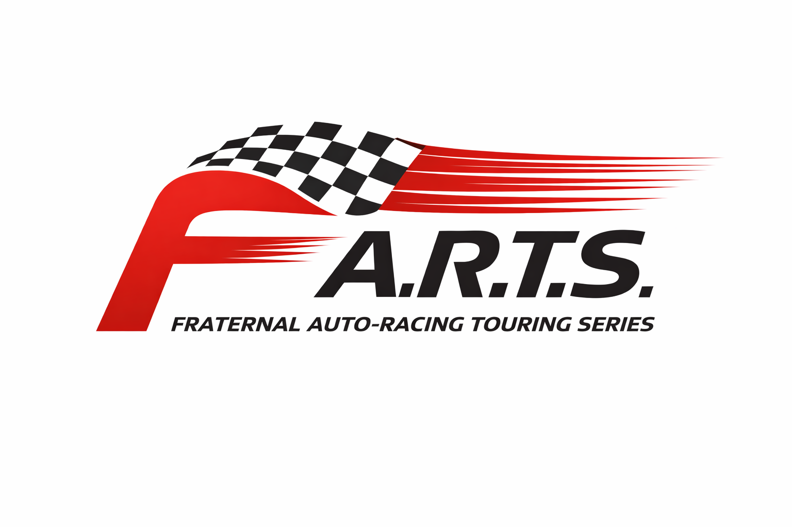
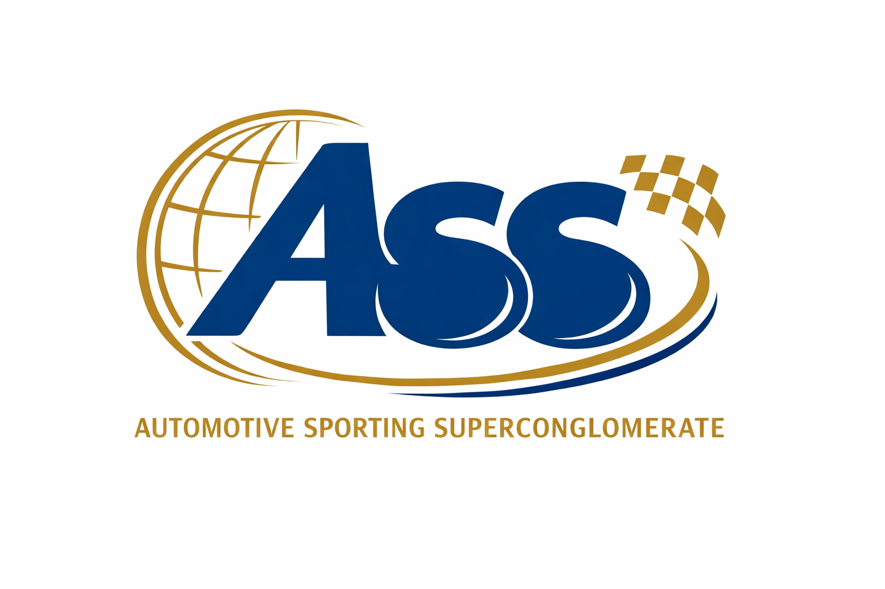

# F.A.R.T.S. - The Fraternal Auto-Racing Touring Series™️

Cause I'm mature!

## About the League

The venerable F.A.R.T.S. is a racing league maintained by the Automotive Sporting Superconglomerate (A.S.S.) with the goal of maintaining an exciting and fun racing league similar to Formula 1, but with a gamer's twist! The league starts in year 1950, and constructors will design a car in Automation, the car company tycoon game, based on league guidelines with technology available from that year. Their cars will then be exported and raced in BeamNG.drive, the soft-body physics driving simulator, in the different Grands Prix scheduled for that year, with the ultimate goal of winning the F.A.R.T.S. Championship!

## About the Conglomerate

The Automotive Sporting Superconglomerate is comprised of all constructors participating in the F.A.R.T.S. and collectively determine the rules for each season. Season guidelines are intentionally started off as very simple in the year 1950 to allow for the most flexibility to start, which will undoubtedly allow for some teams to dominate others. This is where the fun of participating as a constructor comes in.

After the business of racing is done, the regulations for the following year need to be agreed upon. This will require much arguing, delibration, and compromise where teams will attempt to work the rules in their favor, just like in Formula 1. This will cause the rules to quickly become much more contrived, complicated, and nuanced...just like in Formula 1. The goal is for the league to be just as fun on and off the racetrack!

## More Info

You can find the league guidelines [here](./guidelines.md).

## League History

- 1950 F.A.R.T.S. Championship - Inaugural Season
  - [Regulations](./championships/1950/regulations.md)
  - [Races](./championships/1950/races.md)
  - [Participants](./championships/1950/particpants.md)
